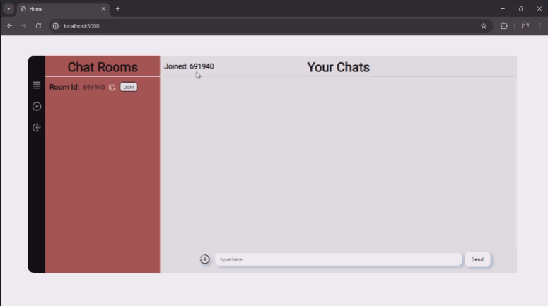

# Real-Time Chat Application

This is a real-time chat application built with Node.js, Express.js, Socket.IO, and MongoDB. It allows users to create and join chat rooms, where they can send and receive messages in real-time.

## Demo Video

[](RealTimeChatWebAppDEMO.mp4)

Click the thumbnail above to watch the demo video.


## Features

- Create new chat rooms
- Join existing chat rooms
- Real-time message broadcasting within a room
- Copy room code to clipboard for easy sharing
- Persistent storage of room data in MongoDB

## Technologies Used

- Node.js
- Express.js
- Socket.IO
- MongoDB (with Mongoose)
- HTML/CSS/JavaScript

## Installation

1. **Clone the repository:**
   ```sh
   git clone https://github.com/your-username/real-time-chat-app.git

2.  **Navigate to the project directory:**
    ```bash
    cd real-time-chat-app
3. **Install dependencies:**
    ```sh
    npm install
    
4. **Set up MongoDB connection:**

- Create a new MongoDB database and update the connection string in `server.js` or use an existing connection string.

4. **Start the server:**
    ```sh
    node server.js 
5. **Open your web browser and navigate to:** 
`http://localhost:3000`.

## Usage

1. Create a new room by clicking the "Create" button.
2. Copy the generated room code and share it with others.
3. Join an existing room by clicking the "Join" button and entering the room code.
4. Start chatting in real-time with other participants in the room.

## Contributing

Contributions are welcome! If you find any issues or have suggestions for improvements, please open an issue or submit a pull request.

## License

This project is licensed under the [MIT License](LICENSE).  
